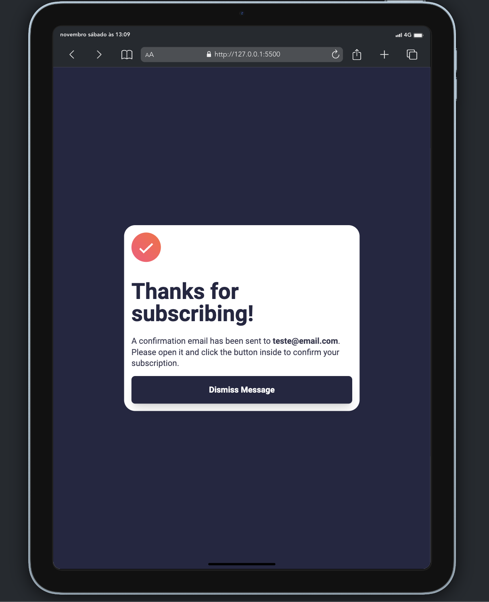

# Frontend Mentor - Newsletter sign-up form with success message solution

This is a solution to the [Newsletter sign-up form with success message challenge on Frontend Mentor](https://www.frontendmentor.io/challenges/newsletter-signup-form-with-success-message-3FC1AZbNrv). Frontend Mentor challenges help you improve your coding skills by building realistic projects.

## Table of contents

- [Overview](#overview)
  - [The challenge](#the-challenge)
  - [Screenshot](#screenshot)
- [My process](#my-process)
  - [Built with](#built-with)
  - [Continued development](#continued-development)
  - [Useful resources](#useful-resources)
- [Gabriel Ferreira](#author)

## Overview

### The challenge

Users should be able to:

- Add their email and submit the form
- See a success message with their email after successfully submitting the form
- See form validation messages if:
  - The field is left empty
  - The email address is not formatted correctly
- View the optimal layout for the interface depending on their device's screen size
- See hover and focus states for all interactive elements on the page

### Screenshot

! Mobile Preview [Mobile Preview](./public/screenshoots/mobile-preview.jpg)





## My process

### Built with

- Semantic HTML5 markup
- CSS custom properties
- Flexbox
- CSS Grid
- Mobile-first workflow
- [Tailwindcss](https://tailwindcss.com/) - CSS library

### Code Samples

```html
<button class="primary-btn" type="button">
  Subscribe to monthly Newsletter
</button>
```

```css
li {
  padding-left: 15px;
  list-style-image: url("../../public/images/icon-list.svg");
}
```

```js
btnSubmitEmail.addEventListener("click", () => {
  if (isValidEmail(emailInput.value)) {
    changeInputSituation("not-conform", "conform");
    emailError.textContent = "";
    changeContainer();
  } else {
    changeInputSituation("conform", "not-conform");
    emailError.textContent = errorMessage;
  }
});
```

### Continued development

Use this section to outline areas that you want to continue focusing on in future projects. These could be concepts you're still not completely comfortable with or techniques you found useful that you want to refine and perfect.

**Note: Delete this note and the content within this section and replace with your own plans for continued development.**

### Useful resources

- [Tailwindcss](https://tailwindcss.com/) - I find immense satisfaction in coding with Tailwind CSS, a robust utility-first framework that offers a paradigm shift in CSS utilization. This library not only enhances efficiency but also provides a fresh perspective on structuring styles. It has become an integral tool, allowing me to approach design and development with a newfound sense of versatility and precision.

## Author

- Website - [Gabriel Portfolio](https://gabrielferreiradev.com.pt/)
- Frontend Mentor - [@GendPh](https://www.frontendmentor.io/profile/GendPh)
